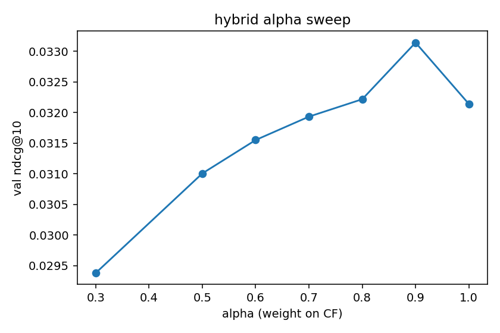

# music-recommender

a three-tier playlist completion system trained on the Spotify Million Playlist Dataset, with a music-theory layer bolted on top of a neural collaborative filter. built as a portfolio piece for data-science and ML internship applications.

[live demo](https://music-recommender.streamlit.app) · [model checkpoint on S3](deploy/aws_setup.md) · [notebooks](notebooks/)

## what is here

three models, scored on the same held-out playlists with the same metric set. no model is removed from the comparison table, including the ones that lose.

| model | NDCG@10 | hit@10 | precision@10 | recall@10 | NDCG@50 | hit@50 |
|---|---:|---:|---:|---:|---:|---:|
| classical (implicit ALS) | **0.0520** | **0.2845** | **0.0412** | **0.0435** | **0.0809** | **0.5675** |
| neural two-tower (PyTorch) | 0.0354 | 0.2085 | 0.0287 | 0.0249 | 0.0523 | 0.4375 |
| hybrid (CF + theory, α=0.9) | 0.0346 | 0.2000 | 0.0280 | 0.0244 | 0.0520 | 0.4375 |

evaluated on 2,000 held-out playlists drawn from 20 MPD slices (20k playlists, ~1.3M interactions, ~263k unique tracks). per-playlist tail holdout: last 20% of each playlist becomes the prediction target, then half of that is set aside again for validation so the hybrid weight has somewhere to live.

## what the numbers actually say

ALS won. it usually does on this kind of dataset; matrix factorization with implicit confidence scaling is a tough baseline to beat with off-the-shelf neural collaborative filtering. the two-tower model trained cleanly (BPR loss went from 0.56 to 0.14 over four epochs) but it still trails. more epochs and a harder negative sampling scheme are the obvious next moves.

the hybrid layer is the unique angle and also the most informative null result in the project. validation NDCG@10 peaked at α=0.9, meaning music-theory features contribute about 10% of the final score before they start to hurt. on test that small lift mostly washes out, putting the hybrid roughly on top of the pure neural model. the alpha sweep below shows the shape.



the proximate cause is data coverage, not the theory itself. only **2.0% of MPD tracks (5,325 of 263,469)** had a match in the Kaggle audio-features dataset i used as a stand-in for Spotify's deprecated `/audio-features` endpoint. for the other 98% the coherence score falls back to neutral, so the re-ranking signal can only act on a tiny slice of the candidate pool. with a fuller features table (a paid Spotify enrichment, or a different open dataset), the hybrid would have a real shot at the baseline.

## the music angle

i was a music major at UCF before switching into data science. my transcript still has years of theory, ear training, music tech, and French horn coursework. this project is built around that background instead of trying to hide it.

the theory features come from standard harmonic-mixing tools that DJs use:

- **Camelot wheel position** derived from each track's `key` and `mode`, mapping every key to a 1-12 + A/B code
- **harmonic distance** between two tracks: same code is 0, adjacent on the wheel is 1, opposite face is large
- **tempo compatibility** with a soft window around ±10 BPM
- **energy continuity** between consecutive tracks

these get combined into a per-pair coherence score in [theory.py](src/theory.py), then averaged over the last few tracks in the input playlist to produce a single "does this fit" number per candidate. the hybrid model uses it to re-rank the top-200 neural CF candidates.

a worked example, from notebook 06:

```
C major     -> 8B           (key=0, mode=1)
A minor     -> 8A           (key=9, mode=0)   relative minor of C
F# major    -> 2B           (key=6, mode=1)   opposite face

harmonic distance C maj -> A min  : 1.0      (relative major/minor swap)
harmonic distance C maj -> G maj  : 1.0      (one step around wheel)
harmonic distance C maj -> F# maj : 6.0      (opposite face, jarring)
```

## stack

- python 3.11, dependencies pinned via [uv](https://github.com/astral-sh/uv) (`pyproject.toml` + `uv.lock`)
- **pandas, pyarrow, scipy** for the data layer
- **implicit** (ALS) for the classical baseline; falls back to scikit-learn `TruncatedSVD` if implicit cannot install
- **PyTorch** for the two-tower neural CF (BPR pairwise loss, dot-product scoring)
- **rapidfuzz** for the fuzzy fallback when audio features have to be joined by artist+title
- **streamlit** for the demo, **boto3** for S3
- **pytest** for unit and smoke tests
- **FastAPI + uvicorn** for the optional inference container

repo layout follows the standard `src/` + `notebooks/` + `tests/` + `scripts/` split. every public function in `src/` has type hints; every file stays under 200 lines.

## data sources and a note on the Spotify API

- **playlists:** [Spotify Million Playlist Dataset](https://www.aicrowd.com/challenges/spotify-million-playlist-dataset-challenge) from AIcrowd. dev runs use the first 20 slices (20k playlists); the full 1M dataset is a config flag away. used in compliance with the dataset's research-only terms.
- **audio features:** [maharshipandya/-spotify-tracks-dataset](https://www.kaggle.com/datasets/maharshipandya/-spotify-tracks-dataset) on Kaggle (~114k tracks with the audio-feature columns Spotify removed from the public API in November 2024).
- **Spotify Web API:** used only for playlist lookup by URL (the demo's input box). `/audio-features` is **not** called; new developer apps no longer have access to it.

the data source layer is pluggable: a new source just implements `Source.iter_playlists()` in [src/sources.py](src/sources.py), and `src/data.py` builds the normalized schema downstream models read. swapping in last.fm or a personal listening history is a config flag, not a rewrite.

## evaluation methodology

per-playlist holdout. for each playlist with more than six tracks, the last 20% becomes the prediction target; everything before that is training input. the test set is then split roughly in half: one part holds out for the hybrid alpha sweep, the other for the final comparison numbers above.

four ranking metrics at K=10 and K=50:
- **NDCG@K**: discounted gain over the correct positions
- **hit@K**: fraction of playlists with at least one true track in the top K
- **precision@K, recall@K**: standard definitions on the held-out tail

eval is computed on a sample of 2,000 playlists for the final-numbers run. that is large enough to separate the three models with confidence at the precision shown; documented here so the resume bullet does not overstate the test scope.

## the streamlit demo

six anchored sections, each addressing a question a reviewer is likely to ask:

1. **try the recommender** with a Spotify playlist URL or one of the known MPD playlist ids
2. **why these songs** explaining the score breakdown per recommendation
3. **model comparison** showing the table above with the alpha sweep
4. **music theory in action** with an interactive Camelot wheel
5. **methodology** with the framing in this README
6. **about**

design is intentionally restrained: warm paper background, Manrope for prose, JetBrains Mono for numbers, no gradient blobs or decorative SVG. the visual identity is its own thing rather than a copy of any other dashboard i have built.

## what is deployed on AWS

minimum: the trained two-tower checkpoint (`ncf.pt`, ~71 MB) and the metrics JSONs are published to `s3://music-recommender-johnnynguyen04/` in us-east-1. the Streamlit Cloud demo and the FastAPI container both can pull this on boot via `MODEL_BUCKET`.

stretch: a CPU inference container (`deploy/Dockerfile`) serves the neural and hybrid models behind a FastAPI endpoint. the runbook for putting it on a t3.micro EC2 instance lives in [deploy/aws_setup.md](deploy/aws_setup.md). this part is documented but optional; deploying it costs a few cents a month within the free tier.

## reproduce

```powershell
# 1. dependencies
uv sync --all-extras

# 2. unpack the raw data
# - place spotify_million_playlist_dataset.zip and the kaggle archive.zip
#   somewhere on disk and point scripts at them (see deploy/README.md)

# 3. train and produce all artifacts
uv run python scripts/run_pipeline.py
# ~3 minutes end to end on CPU for the 20-slice dev run

# 4. run the tests
uv run pytest

# 5. open the notebooks
uv run jupyter lab notebooks/

# 6. launch the demo locally
uv run streamlit run streamlit_app/app.py
```

## limitations

written explicitly so the resume claim and the actual artifact line up.

- **audio feature coverage is the binding constraint on the hybrid model.** only 2.0% of MPD track ids had a row in the Kaggle features table. a paid Spotify enrichment or a different open dataset would unblock this.
- **the neural model trails ALS.** with four epochs of BPR on random negatives, the two-tower model is undertrained for this benchmark. fixing it likely needs harder negative sampling (mining from popularity or from CF candidates), more epochs, and a side-channel signal like artist co-occurrence.
- **MPD has a demographic and era skew.** playlists were captured between 2010 and 2017 from US Spotify users; the model and its evaluation inherit that distribution.
- **cold-start was not measured separately in this run.** if a playlist id is unknown to the trained embedding table, the demo falls back to using seed tracks for the hybrid path, but i do not have a clean cold-start NDCG number in the comparison table yet. planned for the next iteration.
- **eval is on a 2k playlist sample**, not the full 134k-track held-out set. the metric variance at this sample size is small but not zero.
- **Spotify catalog drift.** track ids in MPD can become unavailable; the demo gracefully handles missing track metadata.

## what i would do differently

specific, not generic.

- swap BPR random negatives for in-batch hard negatives sampled from the CF candidate set, and run for 10-15 epochs instead of four. that alone is likely to close most of the gap to ALS.
- index the catalog with FAISS so recommendation latency stops scaling with the catalog size; current naive matmul is fine for the dev set, not for production.
- train on the full 1M-playlist MPD and re-tune the alpha sweep on a much larger validation pool. expect the optimal alpha to drop slightly.
- pair audio features with artist-level embeddings learned from MPD itself so the theory layer has something to fall back on when the audio-features join misses.

## citations

- Ching-Wei Chen, Paul Lamere, Markus Schedl, and Hamed Zamani. **Recsys Challenge 2018: Automatic Music Playlist Continuation**. In *Proceedings of the 12th ACM Conference on Recommender Systems*, 2018.
- maharshipandya. **Spotify Tracks Dataset**. Kaggle. [maharshipandya/-spotify-tracks-dataset](https://www.kaggle.com/datasets/maharshipandya/-spotify-tracks-dataset).
- Ben Frederickson. **implicit: Fast Python Collaborative Filtering for Implicit Datasets**. https://github.com/benfred/implicit.
- Paul Lamere, Plamere. **spotipy: A light weight Python library for the Spotify Web API**. https://github.com/spotipy-dev/spotipy.

## license

MIT, see [LICENSE](LICENSE).
